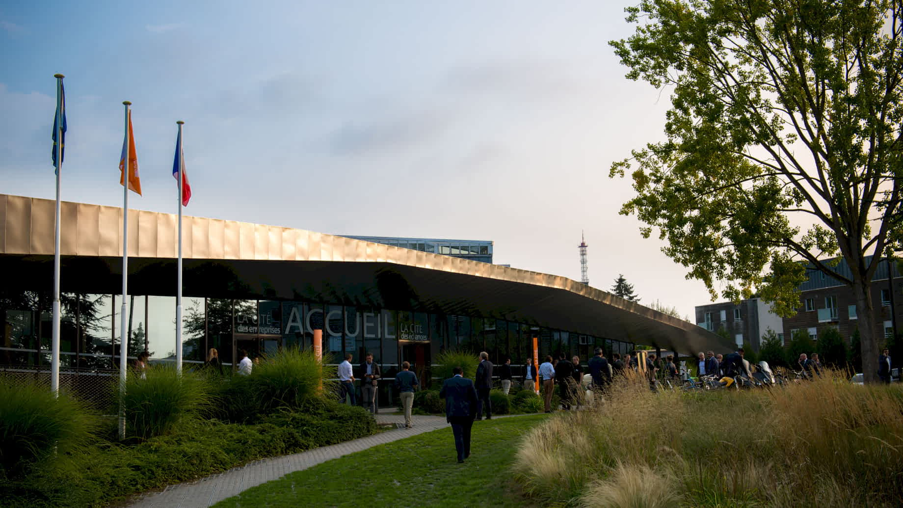

# {{ page.title }}

## Quand 🕗

Une journée complète, le vendredi 20 septembre 2019. On vous attend pour 9H00 avec des viennoiseries et du croissant, avant de démarrer les présentations 30 minutes après.

## Où 🗺️

À “LA CITÉ des Échanges”, juste à côté de Lille, une région pionnière et motrice pour l’e-commerce.

<iframe loading="lazy" src="https://www.google.com/maps/embed?pb=!1m18!1m12!1m3!1d2529.212821896712!2d3.1092103156398365!3d50.660308979504855!2m3!1f0!2f0!3f0!3m2!1i1024!2i768!4f13.1!3m3!1m2!1s0x47c3298c8bbc835f%3A0x531fcce4347c737e!2sLA+CIT%C3%89+des+%C3%A9changes!5e0!3m2!1sfr!2sfr!4v1560419850754!5m2!1sfr!2sfr" width="600" height="450" frameborder="0" style="border:0" allowfullscreen></iframe> <a href="https://goo.gl/maps/P2NTVejeBbngx4YYA"><small>Afficher la carte sur Google Maps</small></a>.

LA CITÉ des Échanges 
40 Rue Eugène Jacquet, 
59700 Marcq-en-Barœul

## Comment venir ?

### En train 🚄

Depuis **Paris**, matin ou soir, dans les deux directions, il y a un [TGV Paris-Lille](https://www.trainline.fr/search/paris/lille/2019-09-20-06:00/2019-09-20-18:00) toutes les 30 minutes. Nous vous conseillons ceux de 7H16 pour arriver sans stress ni attente au petit déjeuner, OU celui de 7H46 pour arriver juste avant la première présentation.
Le prix oscille entre 15 € si vous vous y prenez très tôt et 90 € à la dernière minute.

Comptez ensuite 25 minutes (tramway et marche) pour rejoindre la Cité des Échanges.

### En tramway 🚋 et à pied 🚶‍♂️🚶‍♀️

La station la plus proche de la Cité, à pied, est Acacias (Marcq-en-Barœul). Depuis les gares de Lille, prendre le tramway en direction de Eurotéléport / Roubaix, prévoir 12 à 15 minutes.
Pour votre calcul d’itinéraire, vous pouvez utiliser [Ilevia](https://www.ilevia.fr/cms/institutionnel/se-deplacer/#itineraires) ou consulter le [plan de la ligne en PDF](http://www.ilevia.fr/cms/institutionnel/wp-content/uploads/sites/4/2019/01/tramway.pdf).

À Acacias, traversez la zone résidentielle par l’Avenue des Acacias (1ère rue à droite). Au bout, tourner à droite rue Eugène Jacquet. Au numéro 40 environ, un panneau “Entreprises et Cités” vous indiquera le domaine. Pénétrez dans l’enceinte en suivant la voie principale jusqu’à la Cité des Échanges.

[Itinéraire à pied jusqu’à nos portes](https://www.google.fr/maps/dir/Acacias,+Marcq-en-Bar%C5%93ul/50.6598929,3.1109869/@50.6618326,3.109441,680m/data=!3m1!1e3!4m14!4m13!1m10!1m1!1s0x47c3298eb9631495:0xe704062a7ed6a41e!2m2!1d3.1095316!2d50.6649308!3m4!1m2!1d3.1093697!2d50.6611923!3s0x47c3298c8ab0f019:0x2d0eafefd6ef73b7!1m0!3e2!5m1!1e2).

### En véhicule 🚗

Sur le GPS, indiquez “[LA CITÉ des Échanges](https://www.google.fr/maps/place/LA+CIT%C3%89+des+%C3%A9changes/@50.6603761,3.1092886,17z/data=!4m5!3m4!1s0x47c3298c8bbc835f:0x531fcce4347c737e!8m2!3d50.660309!4d3.111399)” ou directement l’adresse de l’entrée : [40 Rue Eugène Jacquet, 59700 Marcq-en-Barœul](https://www.google.fr/maps/@50.6612032,3.109326,3a,58.7y,143.22h,89.65t/data=!3m6!1e1!3m4!1s5Ug2L9zzKZ4R1355IXjqoQ!2e0!7i13312!8i6656).
Deux grands parkings gratuits vous attendent sur place, l’entrée à pied est au bout du premier.

## Accessibilité ♿️

La CITÉ des Échanges est accessible en véhicule mais également desservie par le Tramway lillois, accessible. L’accueil comme les salles sont prévues pour être accessibles aux Personnes à Mobilité Réduite.

Les interventions ne seront pas retranscrites en direct (vélotypie) ou signées.

Si vous êtes en mesure de prendre en charge cet investissement, ou si vous avez des besoins spécifiques et que ces informations ne vous suffisent pas, [contactez-nous](/contact).

## Alimentation 🥘

Chaque billet pour We Love Speed inclut les prestations d’accueil, pendant les pauses et lors du déjeuner. Un large choix de mets permettra notamment aux végétariens et végans de trouver son bonheur.

Nous invitons les allergiques au gluten à nous contacter pour des préparations sur-mesure.

## Pourquoi Lille ? 💡

- Décentraliser le Web, physiquement. Afin que tous les événements Web n’aient pas lieu à Paris. L’année dernière nous étions à Bordeaux, cette année c’est Lille. Qui sait où nous serons l’année prochaine ?
- Si vous n’habitez pas le Nord, Lille est à seulement 1 heure de Paris en TGV. Et si vous êtes plutôt adepte de l’avion, un aéroport n’attend que vous !
- Les gens y sont chaleureux, la bière excellente.
